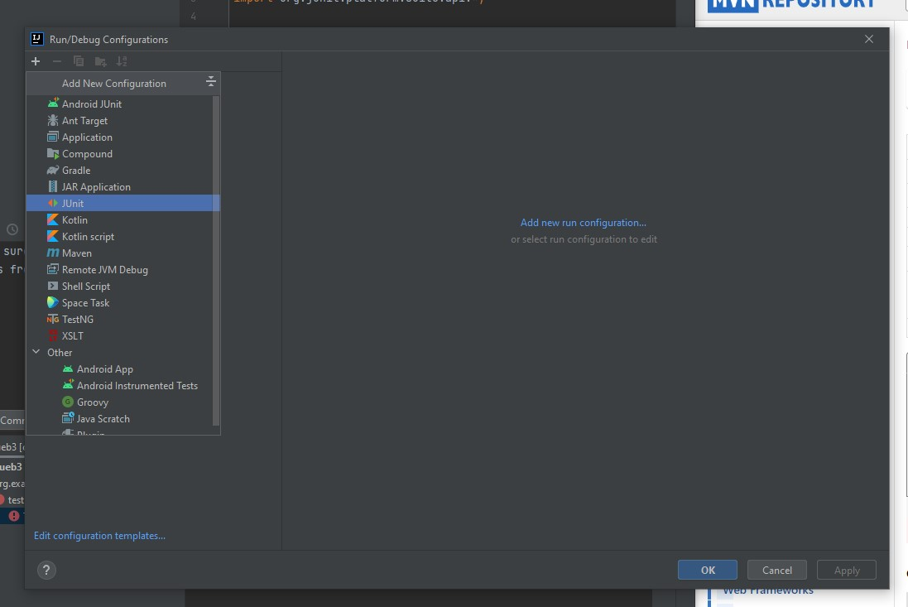
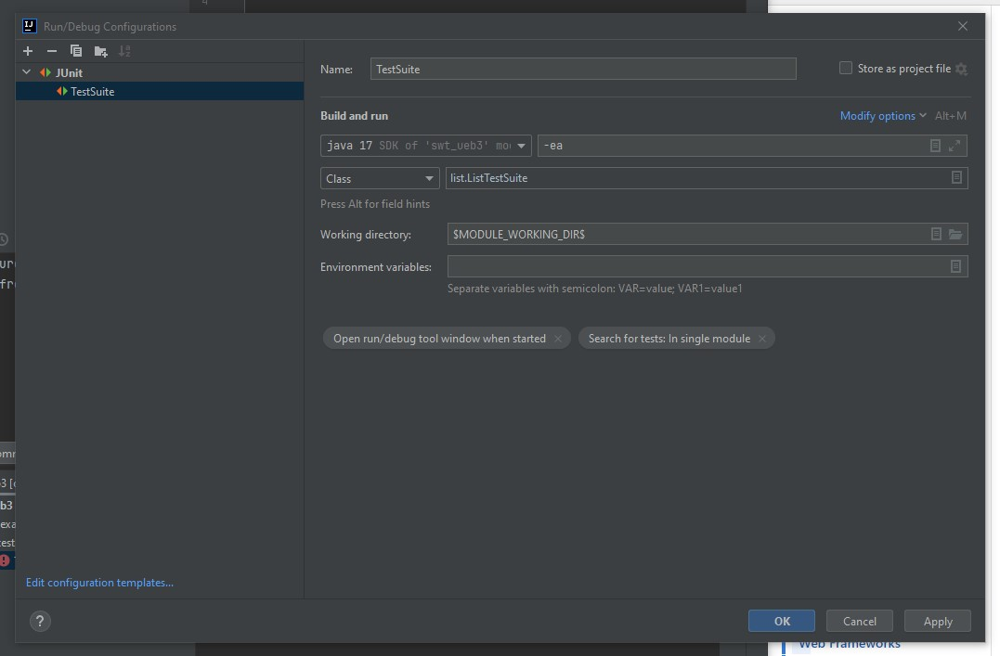

# swt_ueb3

## TODO:
Jeder Testfall in einer neuen Funktion mit @Test.

- AddTest.java: Cong Linh
- SizeTest.java: Victoria
- IteratorTest.java: Tuan

## Tests starten:

1. gehe auf 'Edit Configurations'
2. Erstelle neue junit konfiguration

3. setze list.ListTestSuite als Klasse

4. starten

# Beschreibungen der Schritte

3.
- über IntelliJ Idea ein Maven Projekt erstellt
- Dateistruktur automatisch erstellt, sowie pom.xml
- IntellijJ-Maven Plugin ermöglicht Befehle wie 'compile' für Kompilieren, 'test' für Testvorgänge über Knopfdruck
- alternativ auch über eingebaute konsole möglich, z.B. 'mvn test'
